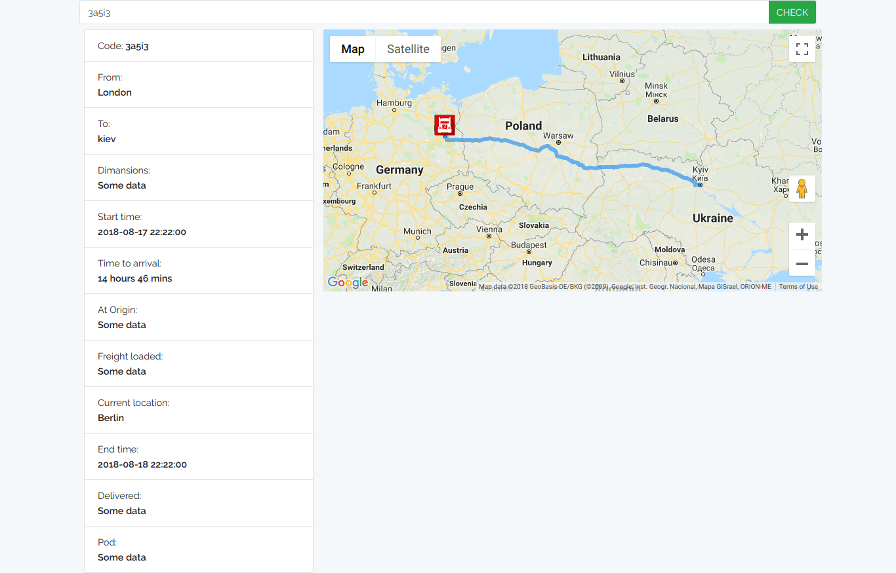
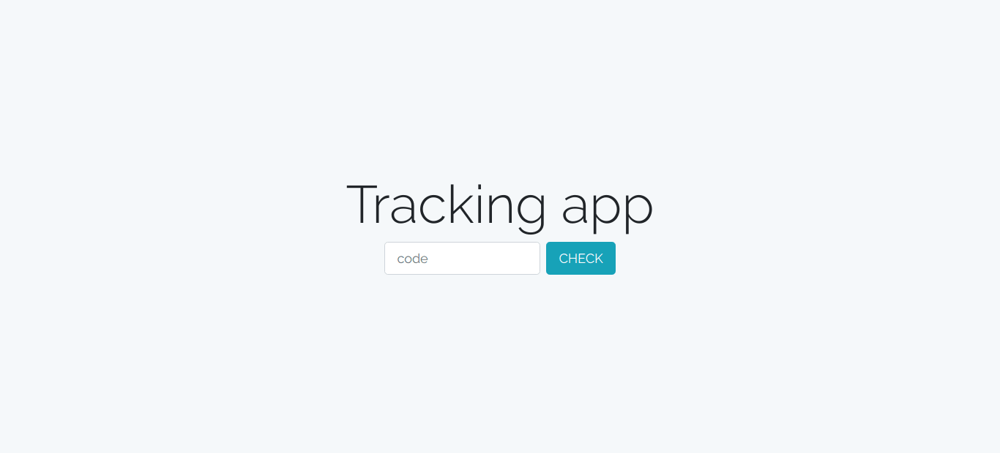
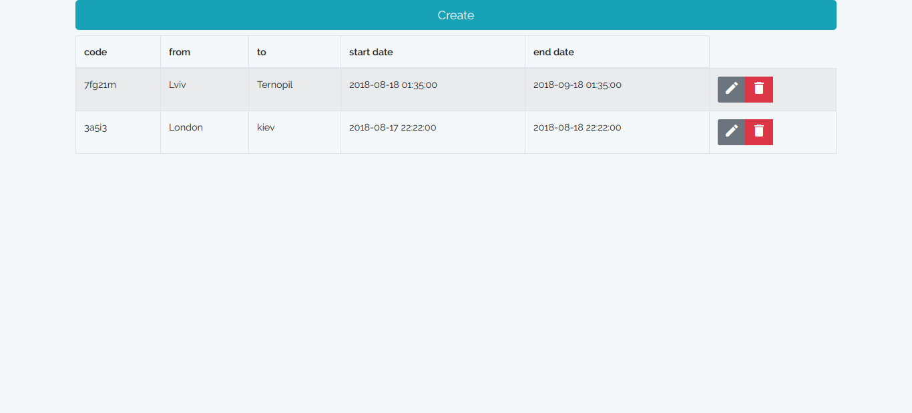
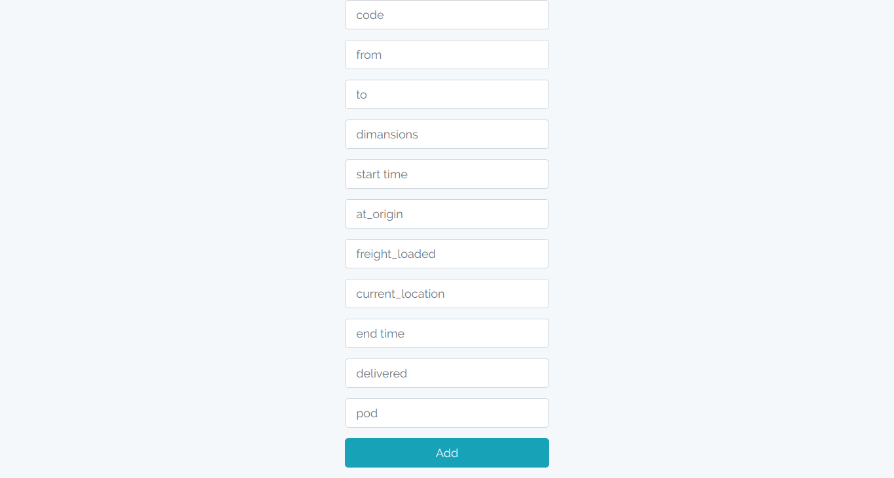

<p align="left">Tracking</p>

## What a this? (screenshots)









# Installation

Clone the repository-
```
git clone https://github.com/Ostap34JS/laravel-tracking.git
```

Then cd into the folder with this command-
```
cd laravel-tracking
```

Then do a composer install
```
composer install
```

Then create a environment file using this command-
```
cp .env.example .env
```

Then edit `.env` file with appropriate credential for your database server. Just edit these two parameter(`DB_USERNAME`, `DB_PASSWORD`).

Then create a database named `tracking` and then do a database migration using this command-
```
php artisan migrate
```

Then change permission of storage folder using thins command-
```
(sudo) chmod 777 -R storage
```

At last generate application key, which will be used for password hashing, session and cookie encryption etc.
```
php artisan key:generate
```

## Run server

Run server using this command-
```
php artisan serve
```

Then go to `http://localhost:8000` from your browser and see the app.

# Todo 
- Add demo